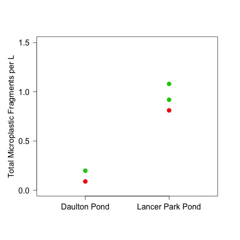

# Analysis of the concentration of microplastic in the ponds
## Metadata

### File created 

* 26 May 2017

### Modified

## Description

These analyses are to evaluate the concentration of microplastic in LPP and DP 

The description of the experiment can be found in [the lab notes](https://github.com/KennyPeanuts/pond_microplastic/tree/master/lab_notebook/lab_notesd)

## Import Data

    plastic.raw <- read.table("./data/pond_microplastic_sp2017.csv", header = T, sep = ",")
    plastic <- read.table("./data/pond_microplastic_means_sp2017.csv", header = T, sep = ",")

## Data Summaries

### Count Summaries

    tapply(plastic.raw$total, plastic.raw$pond, summary) 
    tapply(plastic.raw$total, plastic.raw$pond, sd)
    
~~~~
Number of total microplastic particles per 2 ml subsample of 20 ml dilution

$Blank
   Min. 1st Qu.  Median    Mean 3rd Qu.    Max.  SD 
  2.000   3.000   4.000   3.667   4.500   5.000  1.527525 

$DP
   Min. 1st Qu.  Median    Mean 3rd Qu.    Max.  SD
  18.00   29.00   43.00   43.00   59.25   65.00  19.256168 

$LPP
   Min. 1st Qu.  Median    Mean 3rd Qu.    Max.  SD
   93.0    97.0   111.0   112.4   123.0   146.0  18.385532
~~~~
 
### Concentration Summaries
#### Number per cubic meter

    tapply(plastic$total_m3, plastic$pond, summary)
    tapply(plastic$total_m3, plastic$pond, sd)
    
~~~~
Number of total microplastic fragments per cubic meter

$DP
   Min. 1st Qu.  Median    Mean 3rd Qu.    Max.   SD
  88.89  116.10  143.30  143.30  170.60  197.80   76.99607  

$LPP
   Min. 1st Qu.  Median    Mean 3rd Qu.    Max.   SD
  811.1   865.3   919.4   937.0  1000.0  1081.0   135.58098
  
~~~~

#### Number per L 

    tapply(plastic$total_L, plastic$pond, summary)
    tapply(plastic$total_L, plastic$pond, sd)
    
~~~~
Number of total microplastic fragments per cubic L

$DP
   Min. 1st Qu.  Median    Mean 3rd Qu.    Max.  SD 
0.08889 0.11610 0.14330 0.14330 0.17060 0.19780  0.07699607 

$LPP
   Min. 1st Qu.  Median    Mean 3rd Qu.    Max.  SD
 0.8111  0.8653  0.9194  0.9370  1.0000  1.0810  0.13558098
~~~~

## Analysis

### Create vector of pond factors (i.e., remove data from Blank)

    ponds <- factor(plastic$pond, levels = c("DP", "LPP"))

### Compare Ponds

    t.test(total_L ~ ponds, data = plastic)

~~~~
  Welch Two Sample t-test

data:  total_L by ponds
t = -8.3241, df = 2.999, p-value = 0.003637
alternative hypothesis: true difference in means is not equal to 0
95 percent confidence interval:
 -1.0971907 -0.4902167
sample estimates:
 mean in group DP mean in group LPP 
        0.1433333         0.9370370 
~~~~

## Data Visualization
    
    par(las = 1, oma = c(1, 1, 1, 1))
    plot(total_L ~ as.numeric(ponds), data = plastic, ylim = c(0, 1.5), xlim = c(0.5, 2.5), ylab = "Total Microplastic Fragments per L", xlab = " ",  pch = 19, col = c("darkolivegreen3", "darkorange3", "darkorange3", "darkolivegreen3", "darkolivegreen3"), axes = F, cex = 1.5)
    axis(2)
    axis(1, c("Daulton Pond", "Lancer Park Pond"), at = c(1, 2))
    box()
    points(total_L ~ as.numeric(ponds), data = plastic, cex = 1.5)
    dev.copy(jpeg, "./output/plots/total_L_by_pond.jpg")
    dev.off()
    

